# RawArchive

Train a personalized reply model from your Instagram chats using a local app + Colab GPU fine-tuning on `Qwen/Qwen2.5-3B-Instruct`.

## What This App Does

RawArchive is a full workflow for style-learning from message history:

1. You export Instagram messages as `.json`.
2. You upload them to the local RawArchive web app.
3. RawArchive parses chats and builds a training bundle (`bun_*`).
4. Google Colab fine-tunes a LoRA adapter on top of Qwen 2.5 3B.
5. You register the resulting `adapter.zip` and get a model ID (`mdl_*`).
6. You chat with responses that follow the learned writing style.

Local PC handles ingestion/control/inference. Colab handles GPU training.

## Execution Flow Diagram

```mermaid
flowchart LR
    subgraph LOCAL[Local PC]
        A[Instagram JSON Export] --> B[Web UI Upload<br/>app/static/index.html]
        B --> C[API Upload Endpoint<br/>POST /v1/datasets/instagram/upload]
        C --> D[Parser and Normalizer<br/>app/parser.py]
        D --> E[Bundle Builder<br/>app/dataset_builder.py]
        E --> F[Bundle Artifact<br/>bun_*]
        M[Model Register Endpoint<br/>POST /v1/models/register] --> N[Model ID<br/>mdl_*]
        N --> O[Local Inference Chat<br/>scripts/chat_local.py]
    end

    subgraph CLOUD[Google Colab GPU Runtime]
        G[Notebook<br/>colab/train_lora_ultrafast.ipynb] --> H[Download Bundle<br/>GET /v1/bundles/bun_xxx/download]
        H --> I[Load Qwen Base Model<br/>Qwen/Qwen2.5-3B-Instruct]
        I --> J[LoRA Fine-Tuning<br/>colab/train_lora.py]
        J --> K[Export Adapter<br/>adapter.zip]
    end

    F --> G
    K --> M
    O --> P[Style-Matched Response]
```



## How It Executes (Detailed)

### Stage 1: Ingestion and Parsing

- Input is Instagram export `.json`.
- Upload endpoint stores and validates data.
- Parser extracts senders, timestamps, and message text.
- Normalization removes invalid/empty records and prepares clean samples.

### Stage 2: Bundle Generation

- You select target style/user from parsed chats.
- Builder creates prompt-response training pairs.
- Data is split into train/validation.
- Bundle is created with ID `bun_*`.

### Stage 3: Colab Training

- Colab receives:
  - `BASE_URL` = Cloudflare URL to your local API
  - `BUNDLE_ID` = generated `bun_*`
- Notebook downloads bundle and loads `Qwen/Qwen2.5-3B-Instruct`.
- LoRA adapter layers are trained (not full model weights).
- Output is `adapter.zip`.

### Stage 4: Registration and Inference

- You register adapter in UI Step 4.
- API issues model ID `mdl_*`.
- Local chat script loads base model + adapter and generates replies.

## How To Download Instagram Messages as JSON

Use **Accounts Center** and choose **JSON** format.

### Option A: Instagram App (Phone)

1. Open Instagram app.
2. Go to profile > menu > **Settings and privacy**.
3. Open **Accounts Center**.
4. Go to **Your information and permissions**.
5. Open **Download your information**.
6. Choose the Instagram account.
7. Choose data range (or all time), then select **Messages**.
8. Set format to **JSON**.
9. Submit request and wait for email/notification.
10. Download the archive and extract `.json` files.

### Option B: Instagram Web

1. Open Instagram in browser and log in.
2. Go to **More** > **Settings** > **Accounts Center**.
3. Open **Your information and permissions**.
4. Click **Download your information**.
5. Select account and data type **Messages**.
6. Choose **JSON** format and submit request.
7. Download archive when ready, then extract message `.json`.

Notes:

- Export generation can take time depending on account size.
- Use JSON, not HTML, for RawArchive training.

## Requirements

- Windows + PowerShell
- Python `3.11+`
- Google Colab account
- Internet access (for model downloads in Colab)
- `cloudflared` (required if Colab must reach your local API)

Project files used:

- `app/`
- `colab/`
- `scripts/`
- `tests/`
- `requirements.txt`
- `requirements.inference.txt`

## Deploy (Local + Colab)

### 1) Local Setup

```powershell
py -3.11 -m venv .venv
.\.venv\Scripts\Activate.ps1
pip install -r requirements.txt
```

### 2) Start API

```powershell
.\.venv\Scripts\Activate.ps1
uvicorn app.main:app --host 127.0.0.1 --port 8000 --reload
```

### 3) Start Cloudflare Tunnel (Second Terminal)

```powershell
.\.venv\Scripts\Activate.ps1
cloudflared tunnel --url http://127.0.0.1:8000
```

### 4) Build Bundle in UI

Open `http://127.0.0.1:8000` and:

1. Upload Instagram `.json` files.
2. Build bundle.
3. Copy generated `bun_*`.

### 5) Train in Colab

Notebook: `colab/train_lora_ultrafast.ipynb`

Set:

- `BASE_URL` = `https://...trycloudflare.com`
- `BUNDLE_ID` = your `bun_*`

Run all cells, then download `adapter.zip`.

### 6) Register Adapter

In RawArchive UI Step 4:

- Adapter URI: `local://C:/Users/{your-username}/{your-location}/data/models/adapter.zip`
- Validation Loss: numeric value
- Style Score: numeric value

### 7) Chat Locally

```powershell
.\.venv\Scripts\Activate.ps1
pip install -r requirements.inference.txt
python scripts\chat_local.py --model-id mdl_your_model_id
```

## Exact Run Commands

Run API:

```powershell
uvicorn app.main:app --host 127.0.0.1 --port 8000 --reload
```

Run tunnel:

```powershell
cloudflared tunnel --url http://127.0.0.1:8000
```

Run tests:

```powershell
pytest -q
```

## Privacy and Safety

Private artifacts are intentionally ignored:

- `data/models/adapter.zip`
- `data/datasets/` (raw message content)
- `data/bundles/` (generated training artifacts)
- patterns like `messages*.json` and `conversation*.json`

Verify no private artifacts are tracked:

```powershell
git ls-files | Select-String -Pattern "adapter\.zip|attachment\.zip|messages?\.json|conversation.*\.json"
```

Expected result: no output.

## Troubleshooting

- Colab cannot call `localhost` directly.
- Always pass the Cloudflare URL as `BASE_URL`.
- Keep local API + tunnel running during Colab download/training steps.
- If registration fails, verify file path and `local://` prefix.


### <p align="center">Made by @Yashas.VM & Codex,Claude</p>

